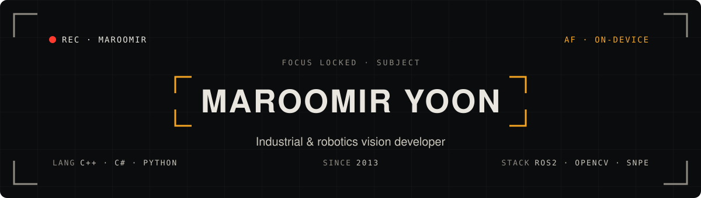

<a href="https://maroomir.vercel.app">
  <picture>
    <source media="(prefers-color-scheme: dark)" srcset="assets/banner-dark.svg">
    <source media="(prefers-color-scheme: light)" srcset="assets/banner-light.svg">
    
  </picture>
</a>

**Path**

Top Engineering → AP Systems → LG Innotek → LG Electronics → Samsung Electronics 
(+ M.S. in Artificial Intelligence, Yonsei University)

**Work**

- **Machine vision** — inspection and alignment for display manufacturing equipment
- **Robotics** — ROS2 applications, AMR, on-device AI
- **Tooling** — vision libraries, CI pipelines, web editors

40+ projects → [maroomir.vercel.app/projects](https://maroomir.vercel.app/projects) · [About](https://maroomir.vercel.app/about)
